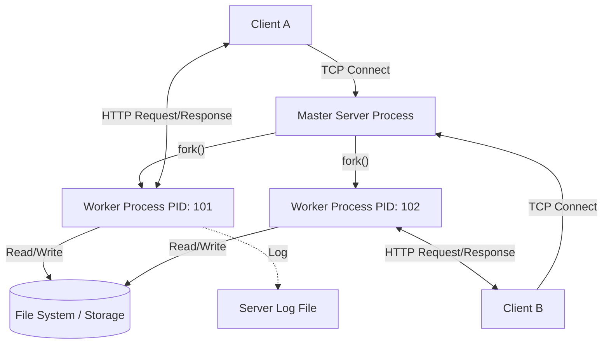
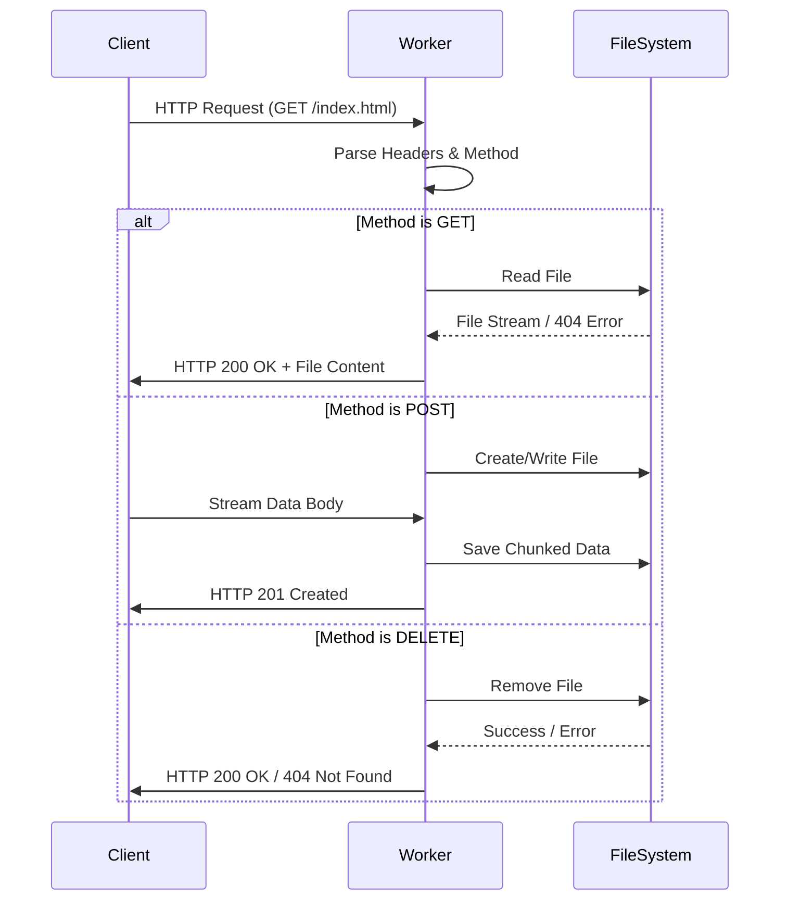

## About project ##

This project is an implementation of a multi-threaded HTTP web server in the C programming language. 
The server is designed to handle basic HTTP requests, support large file transfers, maintain logs, and work with configuration files.
The architecture is based on the “Process-per-Client” model.

Key features:
- HTTP Methods: support for GET (read), POST (upload), DELETE (delete).
- Concurrency: sandling multiple clients simultaneously via fork().
- Keep-Alive: support for persistent connections to reduce the overhead of TCP handshakes.
- Large Files: stream data transfer (stream I/O) without fully loading it into RAM.
- Configuration: flexible configuration via the server.conf file.
- Logging: detailed event logging with different levels (DEBUG, INFO, ERROR, FATAL).

##  Process Architecture

## Request Processing Flow

## Build and Run ##

Project compilation:

make

Starting the server:

./main

Cleaning:

make clean

## Testing ##

pytest -v ./tests/test_server.py
